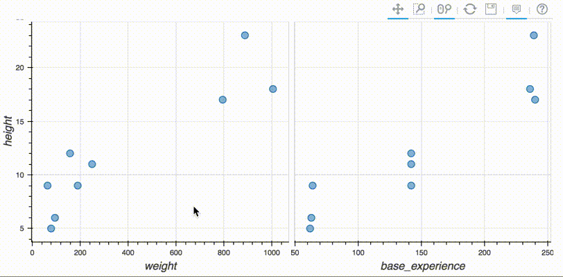

# Tooltip with image in R

## これは何？

マウスオーバーすると画像が出てくるプロットを`R`でさくっと作りたい…．  
そんなあなたにその方法をご説明するためのデモです．

## こんなプロットが作れますよ！

## とにかく試してみたい！

以下の手順でお試しください．  
1. 任意のディレクトリで`git clone https://github.com/ya103/tooltip_with_image_in_r.git`  
2. `cd tooltip_with_image/src`  
3. `Rscript 2_plot_images.R`  
4. `tooltip_with_image/html/plot.html`をブラウザで開いてみましょう！  

## どうやってるの？

[rbokeh](http://hafen.github.io/rbokeh/)という[Bokeh](http://bokeh.pydata.org/)の`R`用のパッケージを使っています．

## カスタマイズしたいんだけど？

例えば，**画像とともにポケモンの名前も表示したい！**といったことがあるかと思います．  
その際には，[こちら](http://bokeh.pydata.org/en/latest/docs/user_guide/tools.html#custom-tooltip)が参考になります．(`python`向けに書かれていますが，同じことは`rbokeh`でもできます．)

## 他のパッケージじゃできないの？

### [plotly](https://github.com/ropensci/plotly)

2つの図でデータをシェアするのは[簡単にできます](https://plotly-book.cpsievert.me/linking-views-without-shiny.html#fig:pipeline)．  
ですが，tooltip(plotly的にはhover)に画像を表示させるには，[JavaScriptの勉強が必要](https://stackoverflow.com/questions/30445198/displaying-image-on-point-hover-in-plotly)のようです…

### [highcharter](http://jkunst.com/highcharter/)

`hc_tooltip()`という関数を使えば，tooltipに画像を表示させるのは[簡単にできます](http://jkunst.com/flexdashboard-highcharter-examples/pokemon/)．  
一方で，図を横に並べて動きをシンクロさせることは，私にはできませんでした…．

### [shiny](https://shiny.rstudio.com/)

> `R`と言えば，shinyでしょ？ 

ごめんなさい，あまり使ったことがなくて…．  
さくっとはできないのではないでしょうか…？

## アイディア元

### [pokemon-visualize-em-all](http://jkunst.com/r/pokemon-visualize-em-all/)  

 * 基本これのパクリです．  
 * jkunstさん凄すぎます…（[jkunstさんのホームページ](http://jkunst.com/)）  

### [pokeapi](https://github.com/phalt/pokeapi) 

 * [jkunstさんのホームページ](http://jkunst.com/)でも紹介されていますが，ポケモン画像のソースです．
 * 教育目的なら利用自由のようです．
